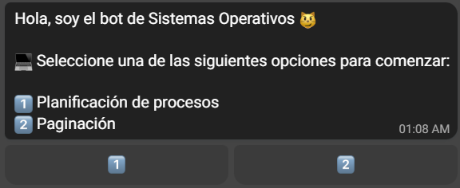

  

## :robot: ¿Qué es Robin?

Robin es un bot de [Telegram](https://t.me/sistemas_operativos_utn_bot)
destinado a los estudiantes de la materia Sistemas Operativos de la Universidad
Tecnológica Nacional.

El objetivo de este programa es brindar herramientas a los estudiantes para poder 
revisar su resolución de los ejercicios de práctica de la materia, permitiendo que los 
mismos avancen en el estudio de la misma fuera del horario de cursado y puedan 
hacer un mejor uso de las clases prácticas. 

Puede a su vez ser utilizado por los docentes durante las clases como un instrumento 
complementario para la enseñanza.

Para mas información, consultar el archivo [robin.pdf](./assets/robin.pdf).

## :robot: ¿Qué puedo hacer con el bot?

Actualmente, Robin resuelve ejercicios de 
[planificación de procesos](#planificación-de-procesos) y [paginación](#paginación).

  

### Planificación de procesos

Dado el nombre de los procesos, sus tiempos de llegada y la cantidad de tiempos de
ejecución de cada uno, Robin calcula la cadena de ejecución del algoritmo 
seleccionado. Además, genera un diagrama de Gantt donde se muestra que proceso 
se está ejecutando en cada instante de tiempo. 

Los algoritmos de planificación disponibles son:
- [Round Robin](https://en.wikipedia.org/wiki/Round-robin_scheduling) 
- [SJF](https://en.wikipedia.org/wiki/Shortest_job_next)
- [FCFS](https://en.wikipedia.org/wiki/FIFO_(computing_and_electronics))
- [STRN](https://en.wikipedia.org/wiki/Shortest_remaining_time)

### Paginación

#### 1. Traducción de una dirección virtual a una física:

Dada una dirección virtual y el tamaño de página, Robin calcula su número de página 
dicha dirección y, luego de ingresar el marco de página correspondiente, traduce la
dirección virtual a una dirección física.

#### 2. Longitud de una dirección física:

Dado el número de marcos de página y el tamaño de marco de página, Robin
calcula la longitud en bits de la dirección física.

#### 3. Longitud de una dirección virtual:

Dado el número de páginas y el tamaño de página, Robin calcula la longitud en bits 
de la dirección virtual.

## :robot: ¿Cómo puedo contribuir con el proyecto?

Hay muchas maneras en las que puedes contribuir con el proyecto:
- Dar una estrella al repositorio ⭐
- Compartir el proyecto con tus compañeros 🧑‍🤝‍🧑
- Reportar errores 🐛
- Proponer nuevas funcionalidades ⚙️

Para reportar errores y proponer nuevas funcionalidades, puedes crear una propuesta
[aquí](https://github.com/dylannalex/robin/issues).
